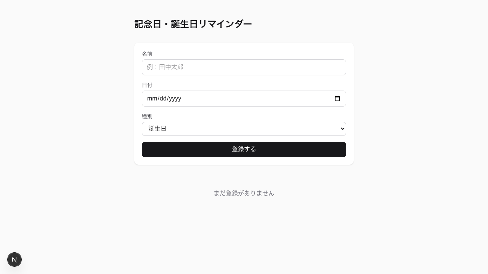
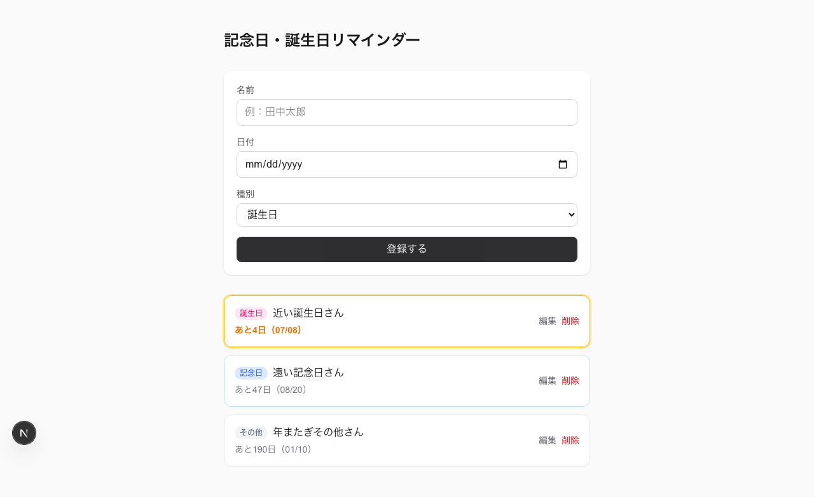
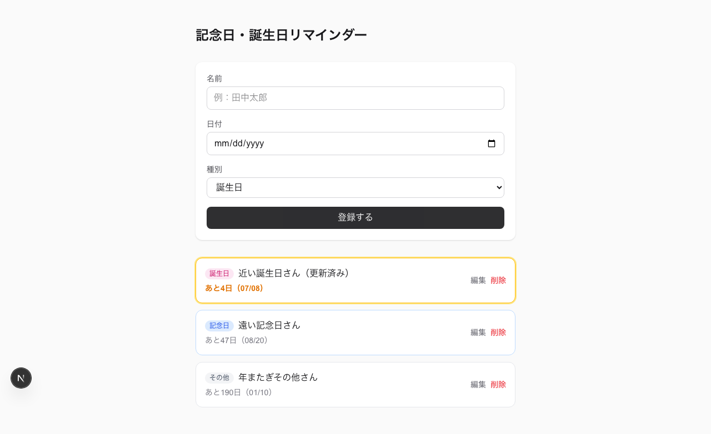

# 記念日・誕生日リマインダー

家族や友人の誕生日・記念日をまとめて登録しておくと、今日から近い順に並び替え、直近7日以内のものを強調表示してくれる個人用 Web アプリです。

## スクリーンショット

| 初期画面 | 登録後の一覧（強調表示・色分け） | 編集後 |
|---|---|---|
|  |  |  |

## 機能

- 名前・日付・種別（誕生日／記念日／その他）の登録
- 今日からの残り日数が近い順への自動ソート
- 残り7日以内の記念日を強調表示
- 種別ごとの色分け表示（誕生日＝ピンク／記念日＝青／その他＝グレー）
- 登録済み項目の編集・削除
- データはブラウザの localStorage に保存（サーバー・DB・認証なし）

## 技術スタック

| 項目 | 内容 |
|---|---|
| 言語 | TypeScript |
| フレームワーク | Next.js（App Router） |
| スタイリング | Tailwind CSS |
| データ保存 | ブラウザ localStorage |
| デプロイ | Vercel |

環境変数は不要です（外部APIキーや認証情報を一切使いません）。

## 開発環境の起動

```bash
npm install
npm run dev
```

`http://localhost:3000` で起動します。

## 公開 URL

（Vercel デプロイ完了後に追記）
